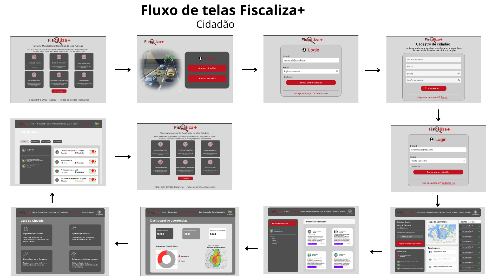

# Introdução

Informações básicas do projeto.

* **Projeto:** [FizcalizaPlus]
* **Repositório GitHub:** [https://github.com/ICEI-PUC-Minas-PMGES-TI/pmg-es-2025-2-ti1-2401100-fiscalizaplus]
* **Link de acesso FiscalizaPlus:** [https://fiscalizaplus.onrender.com/index.html]
* **Membros da equipe:**

  * [Ítalo Eduardo Carneiro da Silva](https://github.com/italocnr)
  * [Luiz Rithiely Barbosa Silva](https://github.com/Luiz-Rithiely)
  * [Vinicius Gabriel Vaz Lomba](https://github.com/viniciusgvaz)
  * [Ulisses Miguel de Freitas Gonçalves](https://github.com/ulissesgoncalvess)
  * [Bernardo Prado](https://github.com/Bzinnnn)
  * [João Paulo Aguiar Prado](https://github.com/jotaaguiar)

A documentação do projeto é estruturada da seguinte forma:

1. Introdução
2. Contexto
3. Product Discovery
4. Product Design
5. Metodologia
6. Solução
7. Referências Bibliográficas

✅ [Documentação de Design Thinking (MIRO)](files/processo-dt.pdf)

# Contexto

Detalhes sobre o espaço de problema, os objetivos do projeto, sua justificativa e público-alvo.

## Problema

As más condições das vias públicas constituem um problema recorrente na sociedade brasileira. Buracos, trincas, sinalização deficiente, faixas de pedestres comprometidas e falta de acessibilidade para pessoas com necessidades específicas são exemplos frequentemente observados por pedestres, motoristas e ciclistas. Esse cenário gera impactos significativos na vida dos cidadãos, como a sensação de insegurança, a maior frequência de manutenções em veículos, as dificuldades de mobilidade e acessibilidade, o aumento no risco de acidentes de trânsito e até mesmo a vulnerabilidade em situações de furtos.
Um dos principais desafios é a ausência de canais claros e eficientes de comunicação entre a população e os órgãos públicos responsáveis. Muitas vezes, os cidadãos não sabem como notificar os problemas ou acreditam que, mesmo realizando a notificação, não terão retorno ou solução. Soma-se a isso a falta de transparência na gestão e na execução das manutenções. Portanto, é necessário buscar soluções inovadoras que possibilitem maior eficiência, segurança, transparência e participação social na resolução dessa problemática.

## Objetivos

O objetivo central deste projeto é desenvolver uma plataforma digital inovadora que possibilite a comunicação direta e transparente entre os cidadãos e os órgãos públicos responsáveis pela manutenção das vias urbanas. A solução busca atuar como um canal oficial e acessível para o registro, acompanhamento e gestão de ocorrências relacionadas a problemas de infraestrutura viária, como buracos, falhas na sinalização, falta de acessibilidade e demais situações que comprometam a segurança e a mobilidade.
De forma mais detalhada, o projeto visa facilitar a participação cidadã por meio de uma ferramenta intuitiva que permita o registro de problemas de forma simples, rápida e georreferenciada. Também pretende ampliar a transparência e a confiança ao possibilitar que o cidadão acompanhe em tempo real o andamento das solicitações e das ações tomadas pelos órgãos competentes. Além disso, o sistema deverá auxiliar na tomada de decisão dos gestores públicos, disponibilizando relatórios e estatísticas que permitam priorizar manutenções com base em critérios técnicos e demandas da população. Outro objetivo importante é contribuir para a redução de acidentes e prejuízos, garantindo que problemas estruturais sejam resolvidos com maior agilidade. A plataforma ainda deve promover inclusão e acessibilidade, oferecendo recursos que permitam a participação de pessoas com deficiência, além de fomentar a cidadania ativa e incentivar a colaboração da sociedade na melhoria do espaço urbano.

## Justificativa

A implementação do software justifica-se pela necessidade urgente de enfrentar a problemática apresentada. De acordo com a Pesquisa CNT de Rodovias 2023, divulgada em 29 de novembro de 2023 pela Confederação Nacional do Transporte (CNT), 67,5% das rodovias brasileiras encontram-se em más condições de conservação. Esse dado evidencia a gravidade da situação e reforça a importância de buscar soluções inovadoras e tecnológicas que contribuam para melhorar a infraestrutura viária.
As más condições das vias públicas não apenas comprometem a mobilidade urbana, mas também impactam diretamente na segurança, na acessibilidade, nos custos de transporte e na qualidade de vida dos cidadãos. Além disso, influenciam na percepção da população em relação à eficiência da gestão pública. Nesse contexto, o desenvolvimento de um software que facilite a comunicação entre sociedade e órgãos responsáveis representa uma alternativa estratégica para aumentar a transparência, a agilidade na resolução de problemas e a confiança da população nos serviços prestados.

## Público-Alvo

O sistema foi pensado para atender pessoas que convivem todos os dias com as más condições das vias públicas e que sentem, de maneira direta, os impactos disso em sua rotina. Esse público é bastante variado, mas todos compartilham o mesmo desejo: se locomover com mais segurança, rapidez e tranquilidade pela cidade.
Entre os usuários estão motoristas de carros, motociclistas, ciclistas e pedestres. Em geral, já utilizam aplicativos de mobilidade como Waze, Google Maps e WhatsApp, e possuem facilidade em lidar com tecnologias simples no celular. Para eles, a grande expectativa é poder registrar problemas de forma rápida, sem burocracia, e ter a certeza de que sua reclamação não ficará esquecida.
Outro grupo essencial são os profissionais que dependem da estrada para trabalhar: motoristas de aplicativo, caminhoneiros e motoristas de ônibus. No dia a dia, eles não podem perder tempo com processos complicados, pois trabalham sob pressão de prazos e precisam garantir a segurança de passageiros ou cargas. Para esse público, a solução representa uma forma de evitar atrasos, reduzir prejuízos e trabalhar com mais confiança.
Além dos cidadãos, também é importante considerar os gestores públicos e as equipes de manutenção. Hoje, esses profissionais enfrentam dificuldades para organizar informações, priorizar as demandas mais urgentes e dar respostas rápidas à população. O sistema surge como uma ferramenta que facilita o trabalho, organiza dados em um só lugar e ajuda na prestação de contas de forma mais transparente.
Por último, existem ainda os atores indiretos, como associações de bairro, sindicatos de transporte, ONGs ligadas à mobilidade e até a imprensa local. Eles podem não usar o sistema diretamente, mas exercem forte influência, dando visibilidade aos problemas e pressionando por melhorias.
Em resumo, o público-alvo da solução vai do cidadão comum até o gestor público, passando pelos profissionais do transporte. Cada um deles se relaciona de forma diferente com a tecnologia, mas todos compartilham a mesma necessidade: ter um canal confiável para relatar problemas, acompanhar o andamento dos reparos e contribuir para uma cidade mais segura e eficiente


# Product Discovery

## Etapa de Entendimento

## Matriz CSD


## Mapa de stakeholders


## Entrevistas qualitativas


## Highlights de pesquisa


## Etapa de Definição

### Personas

| Persona 1 | Persona 2 |
| --------- | --------- |
| |  |

| Persona 3 | Persona 4 |
| --------- | --------- |
| |  |

| Persona 5 | Persona 6 |
| --------- | --------- |
|  |  |

# Product Design

Nesse momento, vamos transformar os insights e validações obtidos em soluções tangíveis e utilizáveis. Essa fase envolve a definição de uma proposta de valor, detalhando a prioridade de cada ideia e a consequente criação de wireframes, mockups e protótipos de alta fidelidade, que detalham a interface e a experiência do usuário.

## Histórias de Usuários

Com base na análise das personas foram identificadas as seguintes histórias de usuários:

| EU COMO...`PERSONA` | QUERO/PRECISO ...`FUNCIONALIDADE`        | PARA ...`MOTIVO/VALOR`               |
| --------------------- | ------------------------------------------ | -------------------------------------- |
| Usuário:  Pedro Almeida - (Design Gráfico e ciclista)  | Registrar e compartilhar informações sobre buracos, falta de ciclo faixas e outros riscos que comprometem o meu trajeto diária. | Eu e outros ciclistas possamos pedalar com mais segurança |
| Usuário: Pedro Almeida - (Design Gráfico e ciclista)  |  Como um defensor da mobilidade sustentável eu quero ter acesso a rotas mais seguras e bem conservadas para ciclistas. | Eu poder planejar meus deslocamentos e incentivar mais pessoas a andarem de bicicleta|
| Usuário:  Pedro Almeida - (Design Gráfico e ciclista) | Como um cidadão engajado, eu quero um canal de comunicação que seja transparente e mostre que minha opnião faz a diferença. | Me sentir motivado a continuar contribuindo para uma cidade melhor |
| Usuário: Aldair Junior (Motorista de Aplicativo)  | Como motorista de aplicativo, eu quero reportar buracos, falta de sinalização e iluminação precária de forma rápida e segura enquanto trabalho.| Evitar danos ao meu veículo e garantir a segurança dos meus passageiros |
| Usuário: Aldair Junior (Motorista de Aplicativo)   | Como motorista de aplicativo, eu quero ter acesso à vias perigosas ou com muitos problemas em minha rota. | Escolher um caminho alternativo e economizar com manutenções periódicas do carro. |
| Usuário: Aldair Junior (Motorista de Aplicativo)   | Como motorista de aplicativo, eu quero visualizar um mapa com a classificação das ruas com base na quantidade de problemas | Oferecer uma viajem mais confortável e segura aos meus passageiros, melhorando a minha avaliação |
| Usuário: Maria Souza (Professora de Escola Pública)  | Como pedestre, eu quero uma forma simples de comunicar sobre calçadas quebradas, falta de faixas e lixo acumulado. | Poder caminhar pelo meu bairro com mais segurança e evitar acidentes. |
| Usuário: Maria Souza (Professora de Escola Pública)  | Como moradora, eu quero receber um retorno sobre os problemas que eu relatei | Sentir que minha participação está ajudando a melhorar a cidade |
| Usuário: Maria Souza (Professora de Escola Pública)   | Como cidadã preocupada com a comunidade, eu quero poder ver os problemas já relatados por outras pessoas na minha região. | Poder apoiar essas reclamações e fortalecer a demanda por melhorias junto aos órgãos públicos. |
| Usuário: Geraldo Teixeira (Servidor Público) | Como servidor público responsável pela manutenção urbana, eu quero visualizar um dashboard com estatísticas gerais das denúncias | Priorizar as ações mais urgentes e ter uma visão geral do trabalho a ser realizado |
| Usuário: Geraldo Teixeira (Servidor Público) | Como servidor público, eu quero poder alterar o status das denúncias e adicionar observações internas | Dar retorno adequado aos cidadãos e manter um histórico organizado das ações tomadas |
| Usuário: Ana Paula Ribeiro (Gestora Pública) | Como gestora pública, eu quero receber notificações sobre novas denúncias críticas que requerem atenção imediata | Garantir que problemas urgentes sejam tratados com prioridade |
| Usuário: Gustavo Oliveira (Cidadão Ativo) | Como cidadão ativo, eu quero participar de uma comunidade onde posso discutir problemas urbanos com outros moradores | Trocar experiências e colaborar na busca por soluções para os problemas da cidade |
| Usuário: Gustavo Oliveira (Cidadão Ativo) | Como cidadão, eu quero visualizar estatísticas sobre meu impacto na comunidade, vendo quantos problemas foram resolvidos através das minhas denúncias | Me sentir motivado e reconhecido pela minha participação cidadã |
| Usuário: Pedro Almeida (Design Gráfico e ciclista) | Como usuário frequente da plataforma, eu quero poder alternar entre tema claro e escuro | Usar a plataforma de forma confortável em diferentes condições de iluminação |
| Usuário: Aldair Junior (Motorista de Aplicativo) | Como motorista que trabalha em horários variados, eu quero poder anexar múltiplas fotos do problema ao fazer uma denúncia | Fornecer informações mais completas e detalhadas sobre o problema encontrado |

## Proposta de Valor

##### Proposta de valor para Persona Aldair Junior 


##### Proposta de valor para Persona Maria Souza


##### Proposta de valor para Pedro Almeida


##### Proposta de valor para Geraldo Teixeira


##### Proposta de valor para Ana Paula Ribeiro


##### Proposta de valor para Gustavo Oliveira


## Requisitos

As tabelas que se seguem apresentam os requisitos funcionais e não funcionais que detalham o escopo do projeto.

### Requisitos Funcionais

| ID     | Descrição do Requisito                                   | Prioridade |
| ------ | ---------------------------------------------------------- | ---------- |
| RF-1 | Módulo de Usuário (Cidadão) | ALTA     |
| RF-1.1 | O sistema deve permitir que um novo usuário se cadastre fornecendo informações básocas (nome, e-mail, senha) | ALTA    |
| RF-1.2 | O sistema deve permitir que usuários cadastrados acessem a plataforma por meio de e-mail e senha. | ALTA       |
| RF-1.3 | O sistema deve oferecer uma funcionalidade para que o usuário possa redefinir sua senha caso a esqueça | BAIXA     |
| RF-1.4 | O usuário logado deve poder criar um novo relato de problema de infraestrutura | ALTA     |
| RF-1.4.1 | O formulário de relato deve permitir a inserção de um título e descrição | ALTA    |
| RF-1.4.2 | O usuário deve poder classificar o tipo de problema (ex: buraco, falta de iluminação, má sinalização, calçada quebrada, lixo acumulado) | MÉDIA     |
| RF-1.4.3 | O sistema deve permitir anexar fotos ou vídeos do problema | BAIXA     |
| RF-1.4.4 | A localização do problema deve ser adicionada, preferencialmente usando o GPS do dispositivo ou selecionando um ponto no mapa | MÉDIA     |
| RF-1.5 | O usuário deve poder visualizar em um mapa todos os relatos de problemas abertos por ele e por outros usuários | MÉDIA     |
| RF-1.6 | O sistema deve exibir uma lista de relatos que pode ser filtrada por tipo de problema, status (aberto, em andamento, resolvido) e localização (proximidade) | MÉDIA     |
| RF-1.7 | O usuário deve poder visualizar o status atual de seus próprios relatos e receber notificações quando houver uma atualização | MÉDIA     |
| RF-1.8 | O usuário deve poder interagir com relatos existentes, adicionando votos de "também sofro com esse problema" | MÉDIA     |
| RF-1.9 | O usuário deve ter uma tela de perfil onde possa ver seus dados e um histórico de todos os seus relatos | ALTA     |
| RF-1.10 | O usuário deve poder acessar uma comunidade para interagir com outros usuários, trocar informações sobre denúncias em andamento e coloborar na resolução de problemas locais | MÉDIA     |
| RF-1.11 | O sistema deve permitir que o usuário visualize relatos recentes registrados na cidade, mesmo sem estar logado | MÉDIA     |
| RF-1.12 | O sistema deve exibir estatísticas sobre o impacto do cidadão, mostrando quantos problemas foram resolvidos através de suas denúncias | MÉDIA     |
| RF-1.13 | O sistema deve fornecer um guia informativo com orientações sobre como usar a plataforma e tipos de problemas que podem ser reportados | BAIXA     |
| RF-1.14 | O sistema deve permitir visualização de mapa de ocorrências semanais na página inicial | MÉDIA     |
| RF-1.15 | O sistema deve exibir destaques da comunidade semanal na página inicial | BAIXA     |
| RF-1.16 | O sistema deve permitir que o usuário visualize suas últimas denúncias no painel da página inicial | MÉDIA     |
| RF-1.17 | O sistema deve exibir atualizações recentes de status das denúncias do usuário | MÉDIA     |
| RF-1.18 | O sistema deve permitir alternância entre tema claro e escuro | BAIXA     |
| RF-1.19 | O sistema deve realizar geocodificação reversa para preencher automaticamente campos de endereço a partir de coordenadas GPS | MÉDIA     |
| RF-1.20 | O sistema deve permitir upload de até 5 imagens por denúncia | MÉDIA     |
| RF-1.21 | O sistema deve gerar código único sequencial para cada ocorrência (formato OCOR-XXXX) | ALTA     |
| RF-1.22 | O sistema deve permitir que o usuário escolha se deseja receber notificações sobre atualizações de suas denúncias | BAIXA     |
| RF-1.23 | O sistema deve permitir que o usuário registre denúncias de forma anônima | BAIXA     |
| RF-2 | Módulo de Administrador (Servidores) | ALTA    |
| RF-2.1 | O sistema deve possuir uma tela de login segura e separada para os usuários administradores | ALTA     |
| RF-2.1.1 | O cadastro de servidor deve exigir um token de acesso válido fornecido pela administração | ALTA     |
| RF-2.2 | O administrador, ao logar, deve ser direcionado a um painel de controle (Dashboard) com estatísticas gerais | ALTA     |
| RF-2.2.1 | Número total de relatos | ALTA     |
| RF-2.2.2 | Relatos por status (abertos, em andamento, resolvidos) | ALTA     |
| RF-2.2.3 | Relatos por tipo de problema | ALTA     |
| RF-2.2.4 | Taxa de resolução de denúncias | ALTA     |
| RF-2.2.5 | Tempo médio de resposta para resolução de denúncias | MÉDIA     |
| RF-2.2.6 | Gráficos de evolução temporal das denúncias | MÉDIA     |
| RF-2.2.7 | Mapa de calor mostrando as áreas com maior concentração de problemas | BAIXA     |
| RF-2.3 | O administrador deve poder visualizar todos os relatos enviados pelos usuários em formato de lista ou em um mapa | ALTA     |
| RF-2.3.1 | O sistema deve permitir busca de denúncias por código de ocorrência | ALTA     |
| RF-2.3.2 | O sistema deve permitir filtros avançados por status, tipo, data e localização | ALTA     |
| RF-2.3.3 | O sistema deve permitir paginação de resultados quando houver muitos registros | MÉDIA     |
| RF-2.4 | O administrador deve ter a permissão para alterar o status de um relato | ALTA     |
| RF-2.4.1 | O sistema deve permitir que o administrador adicione observações internas ao alterar o status | MÉDIA     |
| RF-2.4.2 | O sistema deve permitir que o administrador defina prioridade interna para a denúncia | MÉDIA     |
| RF-2.5 | O sistema deve permitir que um administrador atribua um relato a uma equipe ou departamento específico para resolução | BAIXA     |
| RF-2.6 | O administrador deve poder adicionar comentários a um relato | BAIXA     |
| RF-2.7 | O sistema deve permitir a geração de relatórios com base em filtros | BAIXA     |
| RF-2.8 | O sistema deve exibir notificações para servidores sobre novas denúncias e atualizações | MÉDIA     |
| RF-2.9 | O sistema deve manter um registro histórico de todas as atividades realizadas pelos servidores | MÉDIA     |
| RF-2.10 | O sistema deve permitir que servidores visualizem estatísticas sobre categorias de denúncias | BAIXA     |
| RF-2.11 | O sistema deve permitir que servidores configurem preferências pessoais (notificações, visualização padrão, tema) | BAIXA     |
| RF-2.12 | O sistema deve permitir que servidores visualizem e editem seu perfil | MÉDIA     |

### Requisitos não Funcionais

| ID      | Descrição do Requisito                                                              | Prioridade |
| ------- | ------------------------------------------------------------------------------------- | ---------- |
| RNF-1 | A interface, tanto para cidadão quanto para o administrador, deve ser intuitiva e de fácil utilização | ALTA     |
| RNF-1.1 | A interface deve seguir princípios de design responsivo, adaptando-se a diferentes tamanhos de tela (desktop, tablet, mobile) | ALTA     |
| RNF-1.2 | O sistema deve carregar mapas e listas de relatos de forma rápida | MÉDIA      |
| RNF-1.3 | A autenticação de usuários e administradores deve ser segura | MÉDIA      |
| RNF-1.3.1 | Os dados pessoais dos usuários devem ser protegidos conforme a LGPD | BAIXA      |
| RNF-1.3.2 | Apenas administradores autorizados podem alterar o status dos relatos | ALTA      |
| RNF-1.3.3 | O sistema deve utilizar sessionStorage para gerenciar sessões de usuário | MÉDIA      |
| RNF-1.3.4 | O sistema deve validar dados de entrada em formulários antes de enviar ao servidor | ALTA      |
| RNF-1.4 | O sistema deve estar disponível para uso 24 horas por dia, 7 dias por semana | MÉDIA      |
| RNF-1.5 | A aplicação do cidadão deve ser compatível com os principais navegadores web e sistemas operacionais de smartphones | MÉDIA      |
| RNF-1.5.1 | O sistema deve ser compatível com Chrome, Firefox, Safari e Edge nas versões mais recentes | MÉDIA      |
| RNF-1.5.2 | O sistema deve funcionar em dispositivos móveis com iOS e Android | MÉDIA      |
| RNF-1.6 | O sistema deve ser capaz de suportar um aumento no número de usuários e relatos | BAIXA      |
| RNF-1.7 | O sistema deve ser desenvolvido usando as tecnologias: HTML, CSS e JavaScript | ALTA      |
| RNF-1.8 | O sistema deve implementar tratamento de erros adequado, exibindo mensagens claras ao usuário | MÉDIA      |
| RNF-1.9 | O sistema deve validar formatos e tamanhos de arquivos de imagem no upload (máximo 5 imagens, formatos JPG, PNG) | MÉDIA      |
| RNF-1.10 | O sistema deve realizar geocodificação reversa de forma eficiente, utilizando API externa (Nominatim) | MÉDIA      |
| RNF-1.11 | O sistema deve exibir mapas interativos com boa performance, mesmo com grande quantidade de marcadores | MÉDIA      |
| RNF-1.12 | O sistema deve implementar paginação para listas com muitos registros, melhorando a performance | MÉDIA      |
| RNF-1.13 | O sistema deve permitir alternância entre tema claro e escuro, salvando preferência do usuário | BAIXA      |
| RNF-1.14 | O sistema deve seguir diretrizes de acessibilidade web (WCAG) para garantir uso por pessoas com deficiência | BAIXA      |
| RNF-1.15 | O sistema deve armazenar preferências do usuário (tema, configurações) utilizando localStorage | BAIXA      |
| RNF-1.16 | O sistema deve atualizar automaticamente listas de relatos recentes em intervalos regulares | BAIXA      |
| RNF-1.17 | O sistema deve validar coordenadas GPS antes de permitir registro de denúncia | MÉDIA      |
| RNF-1.18 | O sistema deve garantir que códigos de ocorrência sejam únicos e sequenciais | ALTA      |
| RNF-1.19 | O sistema deve exibir feedback visual durante operações assíncronas (loading, sucesso, erro) | MÉDIA      |
| RNF-1.20 | O sistema deve implementar validação de e-mail e outros campos obrigatórios em formulários | ALTA      |


## Projeto de Interface

Artefatos relacionados com a interface e a interacão do usuário na proposta de solução.

### Wireframes (NONE)


### User Flow





### Protótipo Interativo


✅ [Protótipo Interativo (Figma)](https://www.figma.com/design/z23RymazaezGjc2zokwrtj/Portal-de-Den%C3%BAncias?node-id=0-1&t=ZomV0knojSzHPvgR-1) 


# Metodologia

Detalhes sobre a organização do grupo e o ferramental empregado.

## Ferramentas

Relação de ferramentas empregadas pelo grupo durante o projeto.

### Ferramentas de Desenvolvimento

| Ferramenta | Descrição | Link/Informação |
| ---------- | --------- | -------------- |
| **Visual Studio Code** | Ambiente de Desenvolvimento Integrado (IDE) utilizado para edição de código, depuração e gerenciamento de arquivos do projeto | [https://code.visualstudio.com/](https://code.visualstudio.com/) |
| **Node.js** | Ambiente de execução JavaScript utilizado para rodar o JSON Server e middleware de upload | [https://nodejs.org/](https://nodejs.org/) |
| **npm (Node Package Manager)** | Gerenciador de pacotes utilizado para instalar dependências do projeto (json-server, multer) | Incluído com Node.js |
| **Git** | Sistema de controle de versão distribuído utilizado para gerenciar o código-fonte | [https://git-scm.com/](https://git-scm.com/) |
| **GitHub** | Plataforma de hospedagem de código e controle de versão baseada em Git | [https://github.com/](https://github.com/) |
| **Render** | Plataforma de hospedagem de código  | [https://render.com/](https://render.com/) |


### Ferramentas de Design e Prototipação

| Ferramenta | Descrição | Link de acesso |
| ---------- | --------- | -------------- |
| **Figma** | Ferramenta de design e prototipação utilizada para criar o protótipo interativo da interface | [https://www.figma.com/design/z23RymazaezGjc2zokwrtj/Portal-de-Den%C3%BAncias?node-id=0-1&t=ZomV0knojSzHPvgR-1](https://www.figma.com/design/z23RymazaezGjc2zokwrtj/Portal-de-Den%C3%BAncias?node-id=0-1&t=ZomV0knojSzHPvgR-1) |
| **Miro** | Plataforma colaborativa utilizada para o processo de Design Thinking, criação de mapas mentais, personas e matrizes | [https://miro.com/app/board/uXjVJSvRF1s=/?share_link_id=902482489676](https://miro.com/app/board/uXjVJSvRF1s=/?share_link_id=902482489676) |


### Ferramentas de Teste e Validação

| Ferramenta | Descrição | Link/Informação |
| ---------- | --------- | -------------- |
| **Navegadores Web** | Chrome, Firefox, Safari e Edge utilizados para testes de compatibilidade e validação da aplicação | - |
| **DevTools do Navegador** | Ferramentas de desenvolvedor dos navegadores para depuração, análise de performance e inspeção de elementos | Integrado aos navegadores |
| **Postman / Insomnia** | Ferramentas para teste de APIs REST  | - |

### Ferramentas de Documentação

| Ferramenta | Descrição | Link/Informação |
| ---------- | --------- | -------------- |
| **Markdown** | Linguagem de marcação utilizada para documentação do projeto (README.md) | Padrão de documentação |


## Gerenciamento do Projeto

Esta seção apresenta a organização do trabalho da equipe, as metodologias utilizadas, a divisão de papéis e responsabilidades, e as ferramentas empregadas para o gerenciamento do projeto.

### Metodologia Ágil

O projeto foi desenvolvido utilizando metodologias ágeis, com foco no **Framework Scrum** adaptado para o contexto acadêmico. A abordagem ágil permitiu maior flexibilidade, adaptação a mudanças e entrega incremental de funcionalidades.

#### Processo Scrum

O projeto foi organizado em **Sprints** de desenvolvimento, cada um com duração de aproximadamente  3 a 4 semanas, seguindo o ciclo:

1. **Sprint Planning**: Planejamento das tarefas e definição do backlog da sprint
2. **Daily Standups**: Reuniões conforme necessidade para alinhamento do progresso
3. **Sprint Review**: Apresentação das funcionalidades desenvolvidas
4. **Sprint Retrospective**: Reflexão sobre o que funcionou bem e o que pode ser melhorado

#### Backlog do Produto

O backlog foi organizado por prioridades, considerando:
- **Alta Prioridade**: Funcionalidades essenciais (cadastro, login, reportar ocorrências)
- **Média Prioridade**: Funcionalidades importantes (mapas, filtros, dashboard)
- **Baixa Prioridade**: Funcionalidades complementares (tema escuro, notificações avançadas)

### Processo de Design Thinking

Antes do desenvolvimento técnico, a equipe aplicou o processo de **Design Thinking** para compreender profundamente o problema e as necessidades dos usuários. O processo foi documentado no Miro e seguiu as seguintes etapas:

1. **Empathize (Empatizar)**: Entrevistas qualitativas com potenciais usuários, criação de personas e mapeamento de stakeholders
2. **Define (Definir)**: Definição do problema, criação de matriz CSD (Certezas, Suposições e Dúvidas) e identificação de oportunidades
3. **Ideate (Idear)**: Brainstorming de soluções, criação de mapas de valor para cada persona
4. **Prototype (Prototipar)**: Criação de wireframes e protótipo interativo no Figma
5. **Test (Testar)**: Validação do protótipo e ajustes baseados em feedback

### Divisão de Papéis e Responsabilidades

A equipe foi organizada de forma colaborativa, com membros assumindo diferentes responsabilidades ao longo do projeto:

#### Papéis Principais

| Papel | Responsabilidades | Membros |
|-------|------------------|---------|
| **Product Owner** | Definição de requisitos, priorização do backlog, validação de funcionalidades | Italo Eduardo |
| **Scrum Master** | Facilitação das cerimônias, remoção de impedimentos, garantia do processo ágil | Rotativo entre membros |
| **Desenvolvedores** | Implementação de funcionalidades, testes, documentação técnica | Todos os membros |
| **Designers** | Criação de interfaces, prototipação, experiência do usuário | Todos os membros |
| **QA/Testers** | Testes de funcionalidades, validação de requisitos, reporte de bugs | Todos os membros |

#### Distribuição de Tarefas

As tarefas foram distribuídas considerando as habilidades e interesses de cada membro:

- **Frontend (HTML, CSS, JavaScript)**: Desenvolvimento de interfaces e interatividade
- **Backend (Node.js, JSON Server)**: Configuração de servidor e APIs
- **Design/UX**: Criação de protótipos e definição de interface
- **Documentação**: Elaboração de documentação técnica e de usuário
- **Testes**: Validação de funcionalidades e compatibilidade

### Gestão de Configuração via GitHub

O controle de versão e a gestão de configuração foram realizados utilizando **Git** e **GitHub**, seguindo boas práticas de desenvolvimento colaborativo.

#### Estrutura de Branches

O projeto utilizou uma estratégia de branches para organização do código:

- **main/master**: Branch principal com código estável e testado
- **develop**: Branch de desenvolvimento onde as features são integradas
- **feature/nome-da-feature**: Branches para desenvolvimento de funcionalidades específicas

#### Fluxo de Trabalho (Workflow)

1. **Criação de Branch**: Branch criada a partir da develop para a feature
2. **Desenvolvimento**: Implementação da funcionalidade com commits descritivos
3. **Pull Request**: Criação de PR para revisão e merge na develop
4. **Code Review**: Revisão do código por outros membros da equipe
5. **Merge**: Integração do código após aprovação
6. **Deploy/Teste**: Testes em ambiente de desenvolvimento

#### Convenções de Commit

Os commits seguiram um padrão para facilitar o rastreamento:

```
tipo(escopo): descrição breve

Exemplos:
feat(login): adiciona validação de email no formulário de login
fix(mapa): corrige erro ao carregar marcadores no mapa
docs(readme): atualiza documentação de funcionalidades
style(css): ajusta responsividade do dashboard
```

### Ferramentas de Acompanhamento

#### GitHub Projects (Kanban)

O projeto utilizou o **GitHub Projects** para visualização e acompanhamento das tarefas em formato Kanban, com as seguintes colunas:

- **Backlog**: Tarefas planejadas para sprints futuras
- **To Do**: Tarefas a serem iniciadas na sprint atual
- **In Progress**: Tarefas em desenvolvimento
- **In Review**: Tarefas aguardando revisão de código
- **Testing**: Tarefas em fase de testes
- **Done**: Tarefas concluídas e validadas


### Comunicação e Colaboração

A equipe manteve comunicação constante através de:

- **Reuniões Síncronas**: Reuniões regulares para alinhamento e planejamento
- **Pull Request Reviews**: Revisões de código com feedback construtivo
- **Documentação Compartilhada**: Documentação no README

### Gestão de Qualidade

Para garantir a qualidade do código e da solução:

- **Code Review**: Todas as alterações passaram por revisão antes do merge
- **Testes Manuais**: Validação de funcionalidades em diferentes navegadores
- **Validação de Requisitos**: Verificação de conformidade com os requisitos funcionais
- **Documentação**: Manutenção contínua da documentação do projeto

### Métricas e Acompanhamento

O progresso do projeto foi acompanhado através de:

- **Velocity**: Quantidade de trabalho concluído por sprint
- **Burndown Chart**: Visualização do progresso em relação ao planejado

### Lições Aprendidas

Ao longo do desenvolvimento, a equipe identificou pontos importantes:

- **Comunicação constante** é essencial para evitar retrabalho
- **Code reviews** melhoram significativamente a qualidade do código
- **Documentação contínua** facilita a manutenção e onboarding
- **Testes incrementais** evitam acúmulo de bugs
- **Design Thinking** foi fundamental para entender as necessidades reais dos usuários

# Solução Implementada

Esta seção apresenta todos os detalhes da solução criada no projeto.

## Vídeo do Projeto

O vídeo a seguir traz uma apresentação do problema que a equipe está tratando e a proposta de solução.

[](https://youtu.be/7Hg0y8lGFxE?si=UZcNsDspEQ2qEw-i)


## Funcionalidades

Esta seção apresenta as funcionalidades da solução implementada no FiscalizaPlus.

### Módulo de Cidadão

##### Funcionalidade 1 - Cadastro de Cidadão

Permite que novos usuários se cadastrem na plataforma fornecendo informações pessoais básicas. O sistema valida os dados e verifica se o e-mail já está cadastrado antes de permitir o registro.

* **Estrutura de dados:** [Cidadão]
* **Instruções de acesso:**
  * Acesse a página inicial do sistema
  * Clique em "Cadastrar" ou "Criar conta"
  * Selecione a opção "Cadastro de Cidadão"
  * Preencha o formulário com nome completo, e-mail, estado, cidade e senha
  * Clique em "Cadastrar" para finalizar
* **Tela da funcionalidade**:


##### Funcionalidade 2 - Login de Cidadão

Sistema de autenticação que permite aos cidadãos acessarem a plataforma utilizando e-mail e senha. O sistema suporta login por e-mail completo ou apenas a parte antes do @.

* **Estrutura de dados:** [Cidadão]
* **Instruções de acesso:**
  * Acesse a página inicial do sistema
  * Clique em "Entrar" ou "Login"
  * Informe seu e-mail (ou parte antes do @) e senha
  * Clique em "Entrar" para acessar o painel do cidadão
* **Tela da funcionalidade**:


##### Funcionalidade 3 - Reportar Ocorrência

Permite que cidadãos registrem problemas de infraestrutura urbana com informações detalhadas, incluindo título, descrição, categoria, localização georreferenciada, imagens e informações adicionais sobre prioridade e urgência.

* **Estrutura de dados:** [Denúncia]
* **Instruções de acesso:**
  * Faça login como cidadão
  * Acesse o menu "Reportar Ocorrência" ou "Nova Denúncia"
  * Preencha o título e descrição do problema
  * Selecione a categoria (Infraestrutura, Iluminação, Limpeza, Trânsito, Segurança)
  * Use o mapa interativo para selecionar a localização ou permita o uso do GPS
  * Adicione fotos do problema (até 5 imagens)
  * Informe a prioridade, urgência e impacto na comunidade
  * Escolha se deseja receber notificações sobre atualizações
  * Clique em "Enviar Denúncia" para finalizar
* **Tela da funcionalidade**:


##### Funcionalidade 4 - Dashboard do Cidadão

Painel de controle que exibe estatísticas e gráficos sobre as denúncias do cidadão, incluindo total de denúncias, status (pendentes, em andamento, concluídas), distribuição por tipo de problema e gráficos temporais.

* **Estrutura de dados:** [Denúncia]
* **Instruções de acesso:**
  * Faça login como cidadão
  * Acesse o menu "Dashboard" ou "Painel"
  * Visualize os cards com estatísticas gerais
  * Analise os gráficos de pizza (status) e barras (tipos de problema)
  * Observe o gráfico temporal de denúncias ao longo do tempo
* **Tela da funcionalidade**:


##### Funcionalidade 5 - Painel de Usuário (Minhas Denúncias)

Permite que o cidadão visualize todas as suas denúncias registradas, com opções de filtro por status, tipo de problema e busca por código de ocorrência. Inclui paginação para facilitar a navegação.

* **Estrutura de dados:** [Denúncia]
* **Instruções de acesso:**
  * Faça login como cidadão
  * Acesse o menu "Meu Painel" ou "Minhas Denúncias"
  * Visualize a lista de todas as suas denúncias
  * Use os filtros para buscar por status, tipo ou código
  * Navegue pelas páginas usando a paginação
  * Clique em uma denúncia para ver detalhes completos
* **Tela da funcionalidade**:


##### Funcionalidade 6 - Visualizar Denúncia

Permite visualizar detalhes completos de uma denúncia específica, incluindo todas as informações registradas, imagens, localização no mapa, histórico de atualizações e status atual.

* **Estrutura de dados:** [Denúncia]
* **Instruções de acesso:**
  * Faça login como cidadão
  * Acesse "Minhas Denúncias" ou "Painel de Usuário"
  * Clique em uma denúncia da lista
  * Visualize todas as informações, imagens e localização
  * Observe o histórico de atualizações de status
* **Tela da funcionalidade**:


##### Funcionalidade 7 - Meu Perfil

Permite que o cidadão visualize e gerencie suas informações pessoais, incluindo nome, e-mail, estado, cidade e data de cadastro. Exibe também estatísticas pessoais de participação.

* **Estrutura de dados:** [Cidadão]
* **Instruções de acesso:**
  * Faça login como cidadão
  * Acesse o menu "Meu Perfil" ou clique no avatar/ícone de usuário
  * Visualize suas informações pessoais
  * Observe estatísticas de denúncias registradas
* **Tela da funcionalidade**:


##### Funcionalidade 8 - Comunidade

Fórum de discussão onde cidadãos podem criar tópicos, comentar e interagir sobre problemas urbanos e denúncias. Permite votação em posts e filtragem por categorias.

* **Estrutura de dados:** [Comunidade]
* **Instruções de acesso:**
  * Faça login como cidadão
  * Acesse o menu "Comunidade" ou "Fórum"
  * Visualize as discussões existentes
  * Filtre por categoria usando o menu lateral
  * Clique em "Nova Discussão" para criar um tópico
  * Participe comentando e votando em posts
* **Tela da funcionalidade**:


##### Funcionalidade 9 - Guia do Cidadão

Página informativa que fornece orientações sobre como usar a plataforma, tipos de problemas que podem ser reportados, dicas para criar denúncias eficazes e exemplos práticos.

* **Estrutura de dados:** [Guia](#ti_ed_guia)
* **Instruções de acesso:**
  * Acesse a página inicial ou menu principal
  * Clique em "Guia" ou "Como Usar"
  * Explore as categorias de problemas
  * Leia as dicas e exemplos para cada tipo de denúncia
* **Tela da funcionalidade**:


##### Funcionalidade 10 - Relatos Recentes na Cidade

Exibe uma lista dos relatos mais recentes registrados na cidade, permitindo que cidadãos visualizem os problemas reportados por outros usuários. Funcionalidade visível para todos, mesmo sem login.

* **Estrutura de dados:** [Denúncia]
* **Instruções de acesso:**
  * Acesse a página inicial do sistema
  * Na coluna direita, localize a seção "Relatos Recentes na Cidade"
  * Visualize a lista dos relatos mais recentes (até 10 no desktop, 4 no mobile)
  * Clique em um relato para ver detalhes completos em um modal
  * A lista é atualizada automaticamente a cada 30 segundos
* **Tela da funcionalidade**:


##### Funcionalidade 11 - Meu Impacto

Exibe estatísticas sobre o impacto do cidadão na comunidade, mostrando quantos problemas foram resolvidos através de suas denúncias. Inclui lista das denúncias resolvidas com detalhes.

* **Estrutura de dados:** [Denúncia]
* **Instruções de acesso:**
  * Faça login como cidadão
  * Na página inicial, localize a seção "Seu impacto" abaixo do painel do usuário
  * Visualize o total de problemas resolvidos
  * Veja a lista das últimas 6 denúncias resolvidas
  * Clique em uma denúncia para ver detalhes completos em um modal
* **Tela da funcionalidade**:


##### Funcionalidade 12 - Minhas Últimas Denúncias (Painel do Usuário)

Exibe as últimas denúncias registradas pelo usuário logado diretamente no painel do usuário na página inicial, permitindo acesso rápido às denúncias mais recentes.

* **Estrutura de dados:** [Denúncia]
* **Instruções de acesso:**
  * Faça login como cidadão
  * Na página inicial, localize o "Painel do usuário" na coluna esquerda
  * Visualize a seção "Minhas últimas denúncias"
  * Veja as denúncias mais recentes registradas por você
  * Clique em uma denúncia para ver detalhes ou acesse "Minhas Denúncias" para ver todas
* **Tela da funcionalidade**:


##### Funcionalidade 13 - Destaques da Comunidade Semanal

Exibe os destaques semanais da comunidade, mostrando as discussões mais populares e relevantes do fórum de cidadãos.

* **Estrutura de dados:** [Comunidade]
* **Instruções de acesso:**
  * Acesse a página inicial do sistema
  * Na coluna central, localize a seção "Destaques da Comunidade Semanal"
  * Visualize os posts mais populares da semana
  * Clique em um destaque para ver mais detalhes ou acessar a comunidade
* **Tela da funcionalidade**:


##### Funcionalidade 14 - Mapa de Ocorrências Semanais (Página Inicial)

Mapa interativo na página inicial que exibe as ocorrências da semana, permitindo visualização rápida dos problemas reportados na cidade.

* **Estrutura de dados:** [Denúncia]
* **Instruções de acesso:**
  * Acesse a página inicial do sistema
  * Na coluna central, localize a seção "Mapa de ocorrências semanais"
  * Visualize o mapa com marcadores das denúncias
  * Clique nos marcadores para ver informações básicas
* **Tela da funcionalidade**:


### Módulo de Servidor/Administrador

##### Funcionalidade 15 - Cadastro de Servidor

Permite o cadastro de servidores públicos na plataforma. Requer um token de acesso válido fornecido pela administração e informações como matrícula e órgão de lotação.

* **Estrutura de dados:** [Servidor]
* **Instruções de acesso:**
  * Acesse a página de cadastro de servidor
  * Informe o token de acesso fornecido pela administração
  * Preencha o formulário com nome completo, e-mail, estado, cidade, matrícula e órgão
  * Defina uma senha segura
  * Clique em "Cadastrar" para finalizar
* **Tela da funcionalidade**:


##### Funcionalidade 16 - Login de Servidor

Sistema de autenticação específico para servidores públicos, com acesso separado do módulo de cidadão.

* **Estrutura de dados:** [Servidor]
* **Instruções de acesso:**
  * Acesse a página de login de servidor
  * Informe seu e-mail e senha
  * Clique em "Entrar" para acessar o painel administrativo
* **Tela da funcionalidade**:


##### Funcionalidade 17 - Dashboard Administrativo

Painel de controle completo para servidores, exibindo estatísticas gerais do sistema, KPIs (total de denúncias, taxa de resolução, tempo médio de resposta), gráficos de status, tipos de problema e evolução temporal.

* **Estrutura de dados:** [Denúncia]
* **Instruções de acesso:**
  * Faça login como servidor
  * Acesse o "Dashboard" ou "Painel Administrativo"
  * Visualize os cards com KPIs principais
  * Analise os gráficos de pizza (status), barras (tipos) e linha (temporal)
  * Observe a tabela com as denúncias mais recentes
* **Tela da funcionalidade**:


##### Funcionalidade 18 - Gerenciamento de Denúncias

Permite que servidores visualizem, filtrem e gerenciem todas as denúncias do sistema. Inclui busca por código de ocorrência, filtros por status e tipo, e ordenação por data.

* **Estrutura de dados:** [Denúncia]
* **Instruções de acesso:**
  * Faça login como servidor
  * Acesse o menu "Gerenciar Denúncias" ou "Denúncias"
  * Use os filtros para buscar denúncias específicas
  * Visualize a tabela com todas as denúncias
  * Clique em uma denúncia para ver detalhes e editar
* **Tela da funcionalidade**:


##### Funcionalidade 19 - Visualizar e Editar Denúncia

Permite que servidores visualizem detalhes completos de uma denúncia e atualizem seu status, adicionem observações internas e definam prioridade interna.

* **Estrutura de dados:** [Denúncia]
  * Faça login como servidor
  * Acesse "Gerenciar Denúncias"
  * Clique em uma denúncia da lista
  * Visualize todas as informações, imagens e localização
  * Altere o status (Pendente, Em Andamento, Concluído, Cancelado)
  * Adicione observações internas
  * Defina a prioridade interna
  * Clique em "Salvar Alterações"
* **Tela da funcionalidade**:


##### Funcionalidade 20 - Mapa de Ocorrências (Servidor)

Mapa interativo com visualização administrativa de todas as denúncias, incluindo filtros avançados, visualização por marcadores ou mapa de calor, e informações detalhadas ao clicar nos marcadores.

* **Estrutura de dados:** [Denúncia]
* **Instruções de acesso:**
  * Faça login como servidor
  * Acesse o menu "Mapa de Ocorrências"
  * Use os filtros para visualizar denúncias específicas
  * Alterne entre visualização de marcadores e mapa de calor
  * Clique em um marcador para ver detalhes e editar a denúncia
* **Tela da funcionalidade**:


##### Funcionalidade 21 - Gerenciar Categorias

Permite que servidores visualizem estatísticas sobre as categorias de denúncias, incluindo total de denúncias por categoria e quantidade de denúncias pendentes em cada uma.

* **Estrutura de dados:** [Categoria]
* **Instruções de acesso:**
  * Faça login como servidor
  * Acesse o menu "Gerenciar Categorias" ou "Categorias"
  * Visualize as estatísticas de cada categoria
  * Observe o total de denúncias e pendências por categoria
* **Tela da funcionalidade**:


##### Funcionalidade 22 - Enviar Relatório

Permite que servidores gerem e enviem relatórios sobre denúncias específicas, incluindo informações detalhadas, observações e status atualizado.

* **Estrutura de dados:** [Denúncia]
* **Instruções de acesso:**
  * Faça login como servidor
  * Acesse uma denúncia específica
  * Clique em "Enviar Relatório"
  * Preencha as informações do relatório
  * Adicione observações e atualizações
  * Clique em "Enviar" para finalizar
* **Tela da funcionalidade**:


##### Funcionalidade 23 - Notificações

Sistema de notificações para servidores sobre novas denúncias, atualizações de status e denúncias que requerem atenção imediata.

* **Estrutura de dados:** [Notificação]
* **Instruções de acesso:**
  * Faça login como servidor
  * Acesse o menu "Notificações"
  * Visualize as notificações não lidas
  * Clique em uma notificação para ver detalhes da denúncia
  * Marque notificações como lidas
* **Tela da funcionalidade**:


##### Funcionalidade 24 - Registro de Atividades

Registro histórico de todas as atividades realizadas pelos servidores no sistema, incluindo alterações de status, atualizações e ações realizadas.

* **Estrutura de dados:** [Registro de Atividade]
* **Instruções de acesso:**
  * Faça login como servidor
  * Acesse o menu "Registro de Atividades" ou "Histórico"
  * Visualize o histórico de atividades
  * Filtre por data, servidor ou tipo de ação
* **Tela da funcionalidade**:


##### Funcionalidade 25 - Perfil do Servidor

Permite que servidores visualizem e gerenciem suas informações pessoais, incluindo nome, e-mail, matrícula, órgão de lotação e estatísticas de trabalho.

* **Estrutura de dados:** [Servidor]
* **Instruções de acesso:**
  * Faça login como servidor
  * Acesse o menu "Meu Perfil" ou clique no avatar
  * Visualize suas informações pessoais e profissionais
  * Observe estatísticas de denúncias gerenciadas
* **Tela da funcionalidade**:


##### Funcionalidade 26 - Configurações

Permite que servidores configurem preferências do sistema, incluindo notificações, visualizações padrão e outras configurações pessoais.

* **Estrutura de dados:** [Configurações]
* **Instruções de acesso:**
  * Faça login como servidor
  * Acesse o menu "Configurações"
  * Ajuste as preferências desejadas
  * Salve as alterações
* **Tela da funcionalidade**:


## Estruturas de Dados

Descrição das estruturas de dados utilizadas na solução com exemplos no formato JSON.

##### Estrutura de Dados - Cidadão {#ti_ed_cidadao}

Registro dos cidadãos cadastrados na plataforma, contendo informações pessoais e de localização.

```json
{
  "id": "6cf7",
  "nomeCompleto": "João Silva",
  "email": "joao.silva@email.com",
  "estado": "MG",
  "cidade": "Belo Horizonte",
  "senhaHash": "senha123",
  "dataCadastro": "2025-11-28T13:33:44.969Z"
}
```

##### Estrutura de Dados - Servidor {#ti_ed_servidor}

Registro dos servidores públicos cadastrados na plataforma, contendo informações pessoais, profissionais e de autenticação.

```json
{
  "id": "66c4",
  "nomeCompleto": "Maria Santos",
  "email": "maria.santos@fiscalizaplus.com.br",
  "estado": "MG",
  "cidade": "Belo Horizonte",
  "matricula": "BH090",
  "orgaoId": 2,
  "senhaHash": "senha123",
  "dataCadastro": "2025-12-14T21:23:10.407Z"
}
```

##### Estrutura de Dados - Denúncia {#ti_ed_denuncia}

Registro completo de uma denúncia de problema de infraestrutura urbana, contendo todas as informações fornecidas pelo cidadão e gerenciadas pelos servidores.

```json
{
  "id": "1",
  "titulo": "Buraco na Rua dos Pampas, Prado, Belo Horizonte",
  "tipoProblema": "infraestrutura",
  "descricaoCompleta": "Grande buraco na pista, causando transtornos para motoristas e risco de acidentes.",
  "informacoesAdicionaisCidadao": "Apareceu após as últimas chuvas fortes.",
  "codigoOcorrencia": "OCOR-0001",
  "endereco": {
    "rua": "Rua Carlos Goes",
    "numero": "250",
    "bairro": "Jardim Montanhês",
    "cidade": "Belo Horizonte",
    "estado": "Minas Gerais",
    "cep": "30750-060",
    "latitude": -19.906745100706374,
    "longitude": -43.98083622909395
  },
  "imagens": [
    "/uploads/1764611177346-imagem1.jpg"
  ],
  "prioridadeCidadao": "critica",
  "urgenciaCidadao": "emergencia",
  "impactoComunidade": "regional",
  "dataRegistro": "2025-11-09T19:51:48.313Z",
  "autorCidadao": "João Silva",
  "cidadaoId": "6cf7",
  "isAnonimo": false,
  "statusAtual": "Pendente",
  "dataUltimaAtualizacaoStatus": "2025-11-09T19:51:48.313Z",
  "prioridadeInterna": null,
  "observacoesInternasServidor": "",
  "servidorResponsavelId": null,
  "contatoCidadao": "joao.silva@email.com",
  "recebeNotificacoes": true
}
```

##### Estrutura de Dados - Endereço

Estrutura aninhada dentro de denúncias que armazena informações completas de localização geográfica.

```json
{
  "rua": "Rua Carlos Goes",
  "numero": "250",
  "bairro": "Jardim Montanhês",
  "cidade": "Belo Horizonte",
  "estado": "Minas Gerais",
  "cep": "30750-060",
  "latitude": -19.906745100706374,
  "longitude": -43.98083622909395
}
```

##### Estrutura de Dados - Comunidade {#ti_ed_comunidade}

Registro de posts e discussões na comunidade de cidadãos sobre problemas urbanos.

```json
{
  "id": "1",
  "titulo": "Buraco na Avenida Principal",
  "conteudo": "Alguém mais notou o buraco grande na Avenida Principal?",
  "autor": "João Silva",
  "autorId": "6cf7",
  "category": "infraestrutura",
  "dataCriacao": "2025-11-28T10:00:00.000Z",
  "votos": 5,
  "comentarios": [
    {
      "id": "1",
      "autor": "Maria Santos",
      "autorId": "u123",
      "conteudo": "Sim, já reportei também!",
      "dataCriacao": "2025-11-28T11:00:00.000Z"
    }
  ]
}
```

##### Estrutura de Dados - Categoria {#ti_ed_categoria}

Informações sobre as categorias de problemas disponíveis no sistema.

```json
{
  "id": "infraestrutura",
  "nome": "Infraestrutura",
  "descricao": "Problemas relacionados a ruas, calçadas, pontes e outras estruturas urbanas",
  "icone": "🏗️"
}
```

##### Estrutura de Dados - Órgão Municipal {#ti_ed_orgao}

Registro dos órgãos municipais responsáveis pelo gerenciamento das denúncias.

```json
{
  "id": "1",
  "nome": "Secretaria de Obras",
  "emailContato": "obras@prefeitura.com"
}
```

##### Estrutura de Dados - Token de Acesso {#ti_ed_token}

Tokens utilizados para validação de cadastro de servidores na plataforma.

```json
{
  "id": "tok1",
  "token": "K7M3-N9P2-R4T6-W8Y1",
  "usado": true,
  "dataCriacao": "2025-01-15T10:00:00Z",
  "dataUso": "2025-12-14T21:22:43.012Z",
  "servidorId": 66
}
```

##### Estrutura de Dados - Notificação {#ti_ed_notificacao}

Registro de notificações geradas pelo sistema para servidores sobre novas denúncias ou atualizações.

```json
{
  "id": "1",
  "denunciaId": "1",
  "servidorId": "66c4",
  "titulo": "Nova denúncia registrada",
  "mensagem": "Uma nova denúncia foi registrada no bairro Jardim Montanhês. Requer atenção imediata.",
  "tipo": "nova",
  "lida": false,
  "dataCriacao": "2025-11-09T19:51:48.313Z",
  "badge": "Urgente",
  "importante": true
}
```

##### Estrutura de Dados - Registro de Atividade {#ti_ed_registro_atividade}

Histórico de atividades realizadas pelos servidores no sistema.

```json
{
  "id": "1",
  "servidorId": "66c4",
  "servidorNome": "Maria Santos",
  "denunciaId": "1",
  "codigoOcorrencia": "OCOR-0001",
  "acao": "Alteração de Status",
  "detalhes": "Status alterado de 'Pendente' para 'Em Andamento'",
  "dataAtividade": "2025-11-10T09:00:00.000Z"
}
```

##### Estrutura de Dados - Guia {#ti_ed_guia}

Informações do guia do cidadão com orientações sobre como usar a plataforma.

```json
{
  "id": "infraestrutura",
  "title": "Infraestrutura",
  "description": "Problemas relacionados a ruas, calçadas e estruturas urbanas",
  "icon": "🏗️",
  "longDescription": "Reporte problemas de infraestrutura urbana como buracos, calçadas quebradas, pontes danificadas, etc.",
  "tips": [
    "Tire fotos claras do problema",
    "Informe a localização exata",
    "Descreva o impacto na comunidade"
  ]
}
```

##### Estrutura de Dados - Configurações {#ti_ed_configuracoes}

Preferências e configurações pessoais dos servidores no sistema.

```json
{
  "servidorId": "66c4",
  "notificacoesEmail": true,
  "notificacoesPush": true,
  "visualizacaoPadrao": "tabela",
  "filtrosPadrao": {
    "status": "all",
    "tipo": "all"
  },
  "tema": "claro"
}
```

## Módulos e APIs

Esta seção apresenta os módulos e APIs utilizados na solução FiscalizaPlus.

### Frameworks e Bibliotecas CSS

**Bootstrap:**
* Bootstrap 5.3.2/5.3.8 - [https://getbootstrap.com/](https://getbootstrap.com/)
  * Framework CSS responsivo utilizado para estruturação e estilização da interface
  * Versão utilizada: 5.3.2 e 5.3.8

**Bootstrap Icons:**
* Bootstrap Icons 1.11.1 - [https://icons.getbootstrap.com/](https://icons.getbootstrap.com/)
  * Biblioteca de ícones oficial do Bootstrap utilizada em toda a aplicação

**Font Awesome:**
* Font Awesome 6.4.0 - [https://fontawesome.com/](https://fontawesome.com/)
  * Biblioteca de ícones utilizada para complementar a interface com ícones adicionais

### Frameworks e Bibliotecas JavaScript

**Bootstrap JavaScript:**
* Bootstrap 5.3.2/5.3.8 - [https://getbootstrap.com/](https://getbootstrap.com/)
  * Componentes JavaScript do Bootstrap para modais, dropdowns, tooltips e outros componentes interativos

**Chart.js:**
* Chart.js 4.4.0 - [https://www.chartjs.org/](https://www.chartjs.org/)
  * Biblioteca para criação de gráficos interativos utilizada nos dashboards (gráficos de pizza, barras e linha)
  * Utilizada para visualização de estatísticas de denúncias por status, tipo e evolução temporal

**Chart.js Adapter Date-fns:**
* Chart.js Adapter Date-fns - [https://github.com/chartjs/chartjs-adapter-date-fns](https://github.com/chartjs/chartjs-adapter-date-fns)
  * Adaptador para Chart.js que permite trabalhar com datas utilizando a biblioteca date-fns
  * Utilizado nos gráficos temporais do dashboard administrativo

**Leaflet:**
* Leaflet 1.9.4 - [https://leafletjs.com/](https://leafletjs.com/)
  * Biblioteca JavaScript de código aberto para mapas interativos
  * Utilizada para exibição de mapas com denúncias georreferenciadas

**Leaflet MarkerCluster:**
* Leaflet MarkerCluster - [https://github.com/Leaflet/Leaflet.markercluster](https://github.com/Leaflet/Leaflet.markercluster)
  * Plugin do Leaflet para agrupamento de marcadores em mapas
  * Utilizado para melhorar a visualização quando há muitas denúncias próximas

**Leaflet Heat:**
* Leaflet Heat 0.2.0 - [https://github.com/Leaflet/Leaflet.heat](https://github.com/Leaflet/Leaflet.heat)
  * Plugin do Leaflet para criação de mapas de calor (heatmaps)
  * Utilizado na visualização de densidade de ocorrências no mapa

### APIs Externas

**Nominatim OpenStreetMap:**
* Nominatim API - [https://nominatim.openstreetmap.org/](https://nominatim.openstreetmap.org/)
  * API de geocodificação reversa e busca de endereços do OpenStreetMap
  * Utilizada para:
    - Converter coordenadas GPS (latitude/longitude) em endereços completos (reverse geocoding)
    - Buscar coordenadas a partir de endereços informados pelos usuários
    - Preencher automaticamente campos de endereço (rua, bairro, cidade) ao selecionar localização no mapa

**OpenStreetMap Tiles:**
* OpenStreetMap Tile Server - [https://www.openstreetmap.org/](https://www.openstreetmap.org/)
  * Servidor de tiles (blocos de mapa) do OpenStreetMap
  * Utilizado como base para renderização dos mapas interativos na aplicação

**OpenStreetMap Export:**
* OpenStreetMap Export - [https://www.openstreetmap.org/export](https://www.openstreetmap.org/export)
  * Serviço de exportação de mapas do OpenStreetMap
  * Utilizado para exibir mapas estáticos embutidos nas páginas de visualização de denúncias

### Backend e Servidor

**JSON Server:**
* JSON Server 0.17.4 - [https://github.com/typicode/json-server](https://github.com/typicode/json-server)
  * Servidor REST API simulado que utiliza um arquivo JSON como banco de dados
  * Utilizado para:
    - Simular uma API RESTful completa
    - Gerenciar dados de cidadãos, servidores, denúncias, comunidade e outras entidades
    - Fornecer endpoints para operações CRUD (Create, Read, Update, Delete)
    - Suportar filtros, ordenação e paginação de dados

**Multer:**
* Multer 1.4.5-lts.1 - [https://github.com/expressjs/multer](https://github.com/expressjs/multer)
  * Middleware para Node.js utilizado para upload de arquivos multipart/form-data
  * Utilizado para:
    - Processar upload de imagens das denúncias
    - Armazenar arquivos de imagem no servidor
    - Gerenciar múltiplos arquivos simultaneamente (até 5 imagens por denúncia)

### Tecnologias Base

**HTML5:**
* Linguagem de marcação utilizada para estruturação das páginas web
* Recursos utilizados: elementos semânticos, formulários, validação nativa

**CSS3:**
* Linguagem de estilização utilizada para design e layout das páginas
* Recursos utilizados: variáveis CSS, flexbox, grid, animações, media queries para responsividade

**JavaScript (ES6+):**
* Linguagem de programação utilizada para lógica e interatividade
* Recursos utilizados: async/await, fetch API, arrow functions, template literals, destructuring

**Node.js:**
* Ambiente de execução JavaScript no servidor
* Utilizado para executar o JSON Server e o middleware de upload de arquivos

# Referências

As referências utilizadas no trabalho foram:

## Tecnologias e Frameworks

BOOTSTRAP. **Bootstrap - The most popular HTML, CSS, and JS library in the world**. Disponível em: https://getbootstrap.com/. Acesso em: 15 jan. 2025.

CHART.JS. **Chart.js | Open source HTML5 Charts**. Disponível em: https://www.chartjs.org/. Acesso em: 15 jan. 2025.

LEAFLET. **Leaflet - a JavaScript library for interactive maps**. Disponível em: https://leafletjs.com/. Acesso em: 15 jan. 2025.

FONT AWESOME. **Font Awesome - The Internet's Icon Library & Toolkit**. Disponível em: https://fontawesome.com/. Acesso em: 15 jan. 2025.

TYPICODE. **json-server**. GitHub, 2024. Disponível em: https://github.com/typicode/json-server. Acesso em: 15 jan. 2025.

EXPRESSJS. **multer - Node.js middleware for handling multipart/form-data**. GitHub, 2024. Disponível em: https://github.com/expressjs/multer. Acesso em: 15 jan. 2025.

## APIs e Serviços Externos

OPENSTREETMAP. **Nominatim - OpenStreetMap Foundation**. Disponível em: https://nominatim.openstreetmap.org/. Acesso em: 15 jan. 2025.

OPENSTREETMAP. **OpenStreetMap**. Disponível em: https://www.openstreetmap.org/. Acesso em: 15 jan. 2025.

## Desenvolvimento Web

FLANAGAN, David. **JavaScript: o guia definitivo**. 6. ed. Porto Alegre: Bookman, 2013. 1080 p.

SILVA, Maurício Samy. **CSS3: desenvolva aplicações web profissionais**. 2. ed. São Paulo: Novatec, 2014. 432 p.

FREEMAN, Eric; ROBSON, Elisabeth. **Use a cabeça! HTML e CSS**. 2. ed. Rio de Janeiro: Alta Books, 2013. 768 p.

## Metodologias e Processos

BROWN, Tim. **Design Thinking: uma metodologia poderosa para decretar o fim das velhas ideias**. Rio de Janeiro: Elsevier, 2010. 256 p.

BECK, Kent et al. **Manifesto Ágil**. Agile Alliance, 2001. Disponível em: https://agilemanifesto.org/iso/ptbr/manifesto.html. Acesso em: 15 jan. 2025.

## Infraestrutura Urbana e Participação Cidadã

CONFEDERAÇÃO NACIONAL DO TRANSPORTE (CNT). **Pesquisa CNT de Rodovias 2023**. Brasília: CNT, 2023. Disponível em: https://www.cnt.org.br/pesquisas/pesquisa-cnt-de-rodovias. Acesso em: 15 jan. 2025.

JACOBI, Pedro Roberto. **Participação e deliberação na gestão urbana: desafios e possibilidades**. In: RIBEIRO, Luiz César de Queiroz; SANTOS JÚNIOR, Orlando Alves dos (Org.). **Governança democrática e poder local: a experiência de Porto Alegre**. Rio de Janeiro: Revan, 2004. p. 123-145.

SANTOS, Milton. **A natureza do espaço: técnica e tempo, razão e emoção**. 4. ed. São Paulo: Edusp, 2006. 384 p.


